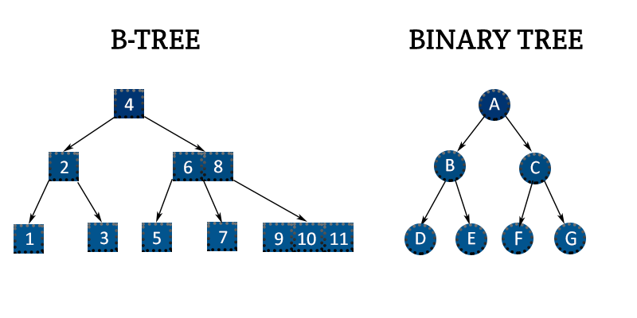
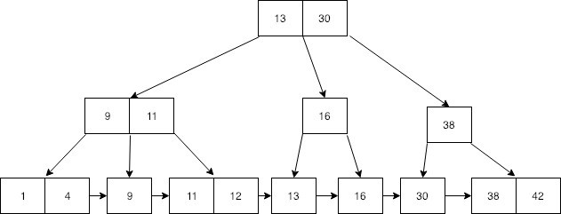

## Index
> Never ever do a full table scan! Use indexes

> Index = storage vs time tradeoff.
> Use more storage to have faster query. 
> Read faster, but write slower.

Index is a ordered (most of the time) representation of indexed data.

Index is a `key=>val` store of: 
`value=>(index page ID, index page item ID)`
In a B-Tree, and B+Tree it's also sorted by value.

### EXPLAIN query
Index only scan - best

Bitmap Heap scan - good
    Bitmap Index scan - using index
    BitmapAdd - combining indexes

```sql
CREATE INDEX ON account_id
CREATE INDEX ON thread_id

SELECT * FROM tbl
    WHERE visible=TRUE 
        AND account_id=1
        AND thread_id=1

-> Bitmap Heap scan
    -> Filter (visible)
    -> BitmapAdd
        -> Bitmap Index Scan on thread_id_index
        -> Bitmap Index Scan on account_id_index
```

### Multi-column index
```sql
CREATE INDEX ON post(thread_id, account_id)
```
Most filtered-by, ordered-by column should be first in multi-column index.
Good analogy is Phone book, which may have `(last_name, first_name)` index, since it's most common to order/filter by `last_name`.

### Partial index
Reduces index size if certain value is not used in queries.

```sql
CREATE INDEX ON post(thread_id, account_id)
    WHERE visible = TRUE;
```

### Precalculated index
Words count in post:
```sql
CREATE INDEX ON post (
    array_length(
        regexp_split_to_array(comment, E'\\s+')
    )
)
```

## B-Tree (Balanced tree index)

Instead of tree, rows could be stored in a single sorted list, and searched using Binary Search.
But for large tables with thousands or millions of rows 
Postgres can’t save all of the sorted data values in a single memory segment.
So list is split into tree.
[http://patshaughnessy.net/2017/12/15/looking-inside-postgres-at-a-gist-index](interesting thoughts)



Similarity to Binary tree: left smaller than right (tree is ordered).

In a B-Tree
- Every node has at most m children. Node can also be called page.
- Every non-leaf node (except root) has at least ⌈m/2⌉ child nodes.
- The root has at least two children if it is not a leaf node.
- A non-leaf node with k children contains k − 1 keys.
- All leaves appear in the same level and carry no information.

Interactive Balanced Tree example:
https://www.cs.usfca.edu/~galles/visualization/BTree.html

SQL B-Tree index example:
```sql
CREATE INDEX ON column_name
CREATE UNIQUE INDEX ON column_name
```

Used by: `< > =` operators

Keys:
- best: different, but not unique keys, foreign keys
- so-so: unique keys (also called random page seeks),
    BRIN may be an alternative 
- bad: very similar keys (for example BOOLEAN)

#### B+Tree`*`
B+Tree: Similar to B-Tree, but non-leaf values are again repeated in leaf nodes


`*` Postgres uses B-Tree

## GIN (Generalized inverse index)

Designed for handling cases where the items to be indexed are composite values, 
and the queries to be handled by the index search within the composite items.
Each part of composite (`array[]` item, row in `jsonb`, or trigram in `text`) becomes a separate value in a tree.

#### Use 1: `text` + gin_trgm_ops operator

Used for full-text search.

[https://niallburkley.com/blog/index-columns-for-like-in-postgres/](article)

`text` operators, utilizing GIN index:
- `LIKE` - case sensitive search
- `ILIKE`- case insensitive search

```sql
CREATE EXTENSION pg_trgm;

-- Example 1: single-column index
CREATE INDEX ON users 
    USING GIN(first_name gin_trgm_ops)

SELECT * FROM users WHERE first_name ILIKE '%doe%';

-- Example 2: multiple-column index
CREATE INDEX ON users
    USING GIN(first_name gin_trgm_ops, last_name gin_trgm_ops)

SELECT * FROM users WHERE first_name || ' ' || last_name ILIKE '%John Doe%'
```

#### Use 2: `jsonb` + default operator

`jsonb` operators, utilizing GIN index:
- `@> or <@` - path/value [exists or contains] operators
- `? ?& ?|` - top-level key-exists operators

[https://www.postgresql.org/docs/12/datatype-json.html#JSON-INDEXING](more about indexing `jsonb`)

```sql
CREATE INDEX idxgin ON tbl USING gin (jdoc_col);
-- Find documents in which the key "company" has value "Magnafone"
SELECT jdoc_col->'guid', jdoc_col->'name' FROM tbl 
    WHERE jdoc_col @> '{"company": "Magnafone"}';

CREATE INDEX idxgintags ON tbl USING gin ((jdoc_col -> 'tags'));
-- Find documents in which the key "tags" contains array element "qui"
SELECT jdoc->'guid', jdoc->'name' FROM api
    WHERE jdoc_col @> '{"tags": ["qui"]}';
```

#### Use 3: `tsvector` + default operator

**Theory** For `tsvector` GIN stores stemmed words, or lexemes (`cats` is stored internally as `cat`). 
Suitable for full-text search if lexeme search is appropriate.

`tsvector` operators, utilizing GIN index:
`@@` - tsvector match against tsquery
```sql
CREATE INDEX ON posts USING GIN(post_name)
-- post_name is tsvector type
SELECT post_name FROM posts 
    WHERE post_name @@ to_tsquery('cat & rat');
```

#### Use 4: `array[__almost_anything__]` + default operator

`array[]` operators, utilizing GIN index:
- `&&` - overlap (have elements in common)
- `<@ @> =`

```sql
CREATE INDEX idx on tbl USING GIN ("teeth_list");

-- if array has small amount of items, do:
SET enable_seqscan TO off;

SELECT * FROM tbl 
    WHERE teeth_list @> ARRAY[11, 12];
```

## GIST (Generalized Search Tree)

GIST is a framework.
Any data type type can be made to work with GIST.

Difference from B-Tree index:
- data is not ordered
- key ranges can overlap

TODO: Maybe investigate more

#### Use 1: ranges, like tsrange (timestamp range), arrays, geometries
#### Use 2: PostGIS
#### Use 3: full-text search instead of GIN

## BRIN (Block range index)

Every table in Postgres is an array of pages (usually 8 kB each).
BRIN uses this and stores min/max value of idexed fields for each page.
BRIN index is not a tree.
A B-Tree alternative for random page seeks in a huge table with corellation between value and physical location of a row.

Takes much less space than B-Tree index, but is slower.

Operators, utilizing BRIN index:
`< > =`

```sql
CREATE INDEX brind_idx on tbl using brin(inserted_at);
SELECT * FROM tbl WHERE inserted_at BETWEEN _date1 AND _date2
```

## Hash index (hash table index)

Good only for `=` operator