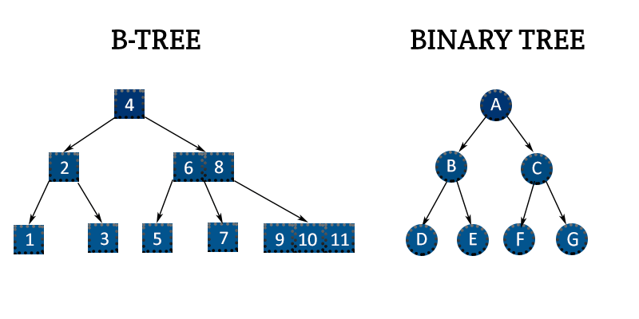

## Index
> Never ever do a full table scan! Use indexes

Index = storage vs time tradeoff. 
> It makes read faster, but writing slower.
> Use more storage to have faster query.

Index is a ordered representation of indexed data.

Index is a `key=>val` store of: 
`value=>(table page ID, table page item ID)`
In a B-Tree it's also sorted by value.

### EXPLAIN query
Index only scan - best

Bitmap Heap scan - good
    Bitmap Index scan - using index
    BitmapAdd - combining indexes

```sql
CREATE INDEX ON account_id
CREATE INDEX ON thread_id

SELECT count(*) FROM tbl
    WHERE visible=TRUE 
        AND account_id=1
        AND thread_id=1

-> Bitmap Heap scan
    -> Filter (visible)
    -> BitmapAdd
        -> Bitmap Index Scan on thread_id_index
        -> Bitmap Index Scan on account_id_index
```

### Multi-column index
```sql
CREATE INDEX ON post(thread_id, account_id)
```
Most filtered-by, ordered-by column should be first in multi-column index.
Good analogy is Phone book, which may have `(last_name, first_name)` index, since it's most common to order/filter by `last_name`.

### Partial index
Reduces index size if certain value is not used in queries.

```sql
CREATE INDEX ON post(thread_id, account_id)
    WHERE visible = TRUE;
```

### Precalculated index
Words count in post:
```sql
CREATE INDEX ON post (
    array_length(
        regexp_split_to_array(comment, E'\\s+')
    )
)
```

### B-Tree (Balanced tree index)



Similarity to Binary tree: left smaller than right (tree is ordered).

In a B-Tree
- Every node has at most m children. Node can also be called page.
- Every non-leaf node (except root) has at least ⌈m/2⌉ child nodes.
- The root has at least two children if it is not a leaf node.
- A non-leaf node with k children contains k − 1 keys.
- All leaves appear in the same level and carry no information.

Interactive Balanced Tree example:
https://www.cs.usfca.edu/~galles/visualization/BTree.html

SQL B-Tree index example:
```sql
CREATE INDEX ON column_name
CREATE UNIQUE INDEX ON column_name
```

Used by: `< > =` operators

Keys:
- best: different, but not unique keys, foreign keys,
unique keys
- bad: very similar keys (for example BOOLEAN)

#### B+Tree
B+Tree: Similar to B-Tree, but non-leaf values are again repeated in leaf nodes


### GIN (generalized inverse index)

Used with `array`, `jsonb`, `tsvector` (for full-text search) types

Used by: gin (`@@ @@@`...) , jsonb (`? ?& ?| @>`) operators

```sql
post_name::tsvector (array)

CREATE INDEX ON posts 
    USING GIN(post_name)
-- or
    USING gin (first_name gin_trgm_ops, last_name gin_trgm_ops)
```

### Not very often used:

#### Hash index (hash table index)

Good only for == comparisons

#### BRIN (block range index)

- stores min/max value for indexed fields
- takes very little space